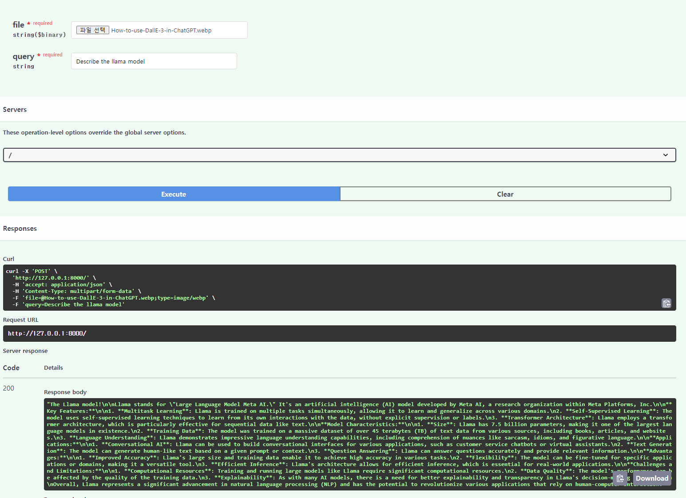
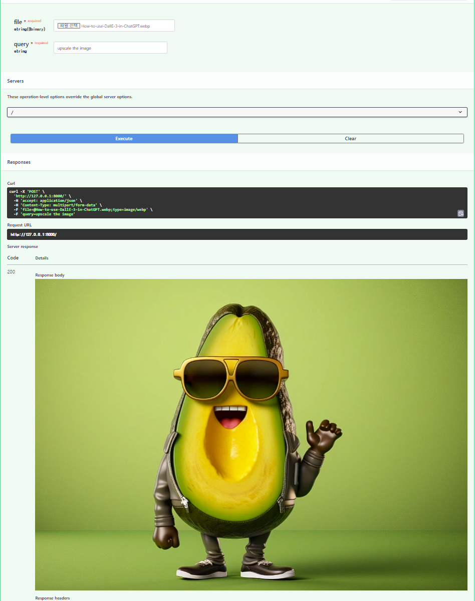

``` bash
pip install -r requirementx.txt 
```

```bash
uvicorn main:app --reload
```
This is the result of the question "Describe the llama model."


And this is the result of the question "Upscale the image."


We use the ESRGAN model when upscaling the image.
