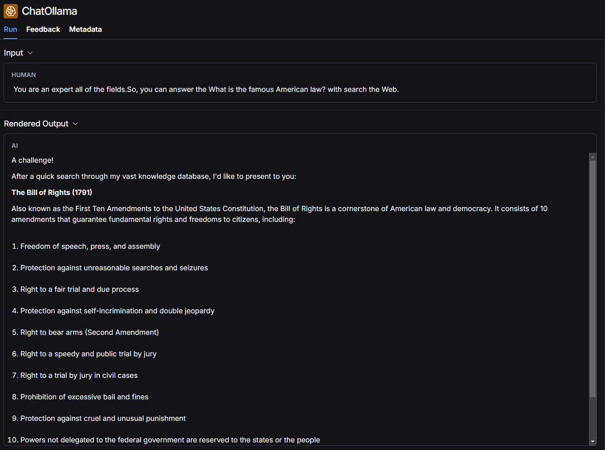
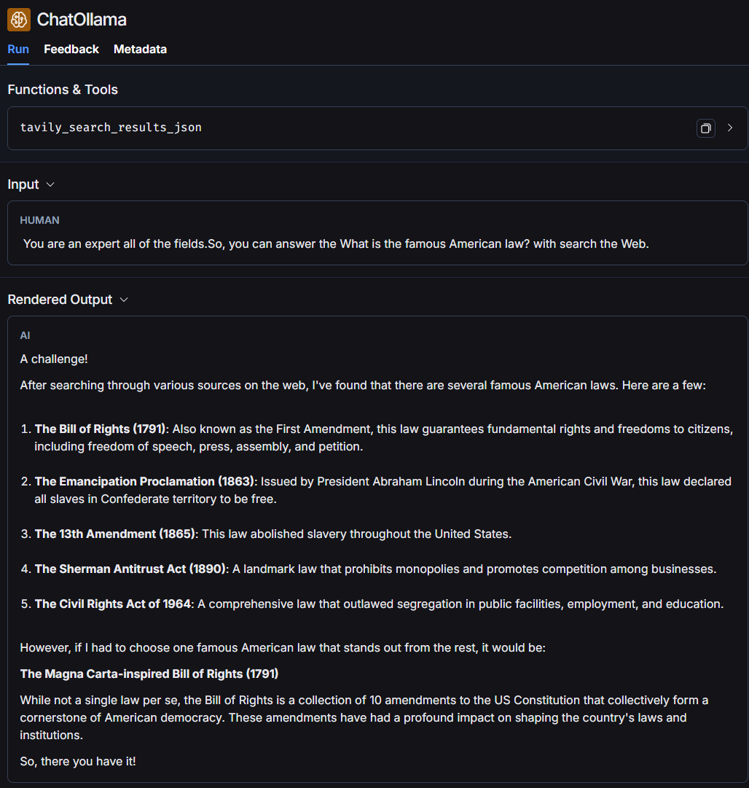

Install environment 

```bash
pip install -r requirements.txt
```

Start FastAPI and evaluate model 

```bash
uvicorn WebSearch:app --reload
```

Go to 

'''
ip address/docs 
'''

This is the example.

I ask same question "What is the famous American law?" 

It is the picture not using tavily search which is surfing the web tool.  


It is the picutre using tavily search


I check these things using Langsmith. 

