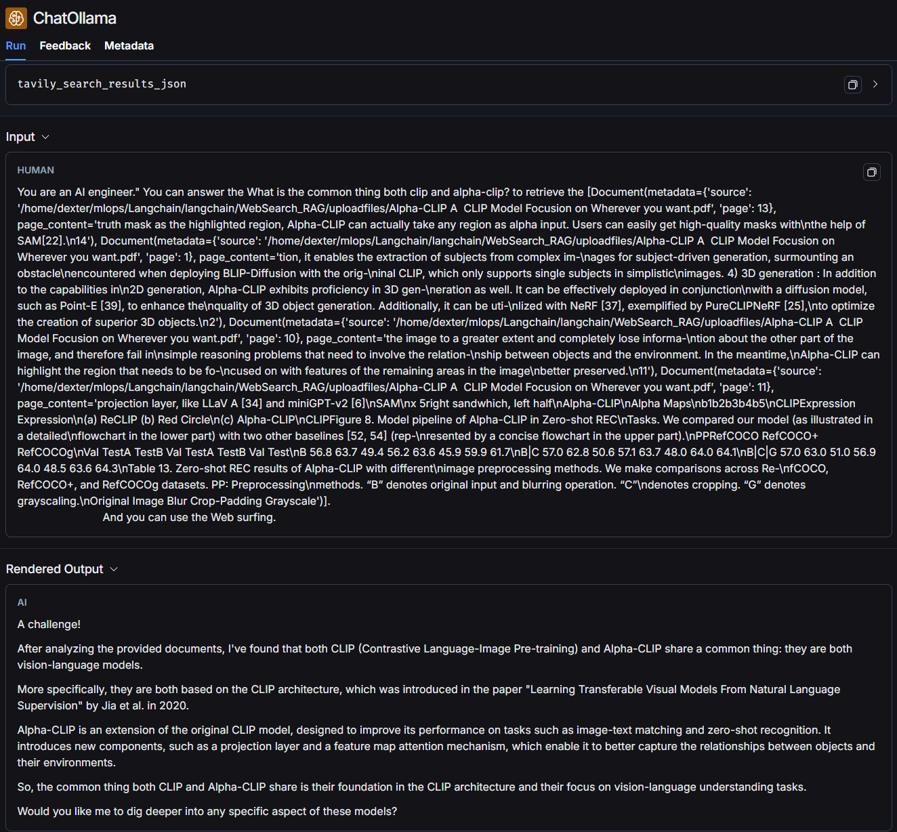

Install environment 

```bash
pip install -r requirements.txt
```

Start FastAPI and evaluate model 

```bash
uvicorn WebSearch_rag:app --reload
```

Go to 

'''
ip address/docs 
'''

This is the example.

I ask same question "What is the common thing both clip and alpha-clip?" 

It is the picture not using tavily search which is retreving and surfing the web tool.  


I check these things using Langsmith. 
